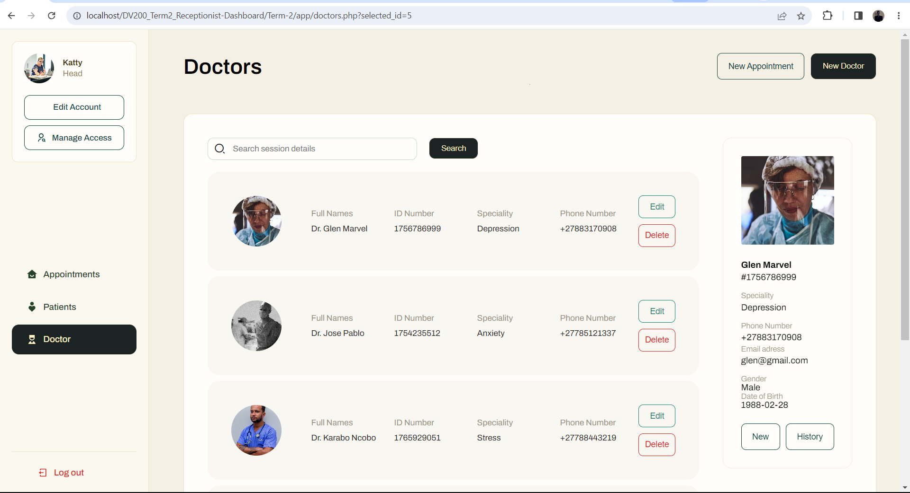
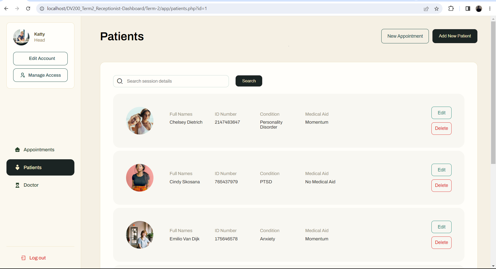

# MedLink
 > A dashboard designed for receptionists at a therapy clinic.

## Project Background
#### This is a term 2 project where we were tasked to:
* Create and modify databases, 
* Store and retrieve information in those databases and 
* Generate web pages from the retrieved data. 
* Set up a local development environment, and use it to administer code and data

## Build Status
The dashboard can complete most required functionalities assigned in the brief.There are minor user experience issues not attended to, however the dashboard completes most features.

## Preview

## Tech/Framework used

| Styling  | Front-End Functionality | Backend  | Database |
| ------------- |:-------------| ------------- |:-------------:|
| CSS      | Javascript     |PHP|MySQL

## Features

* CRUD Functionality for a Patient, Doctor and Receptionist
* Login and Register capability
* Add Images

